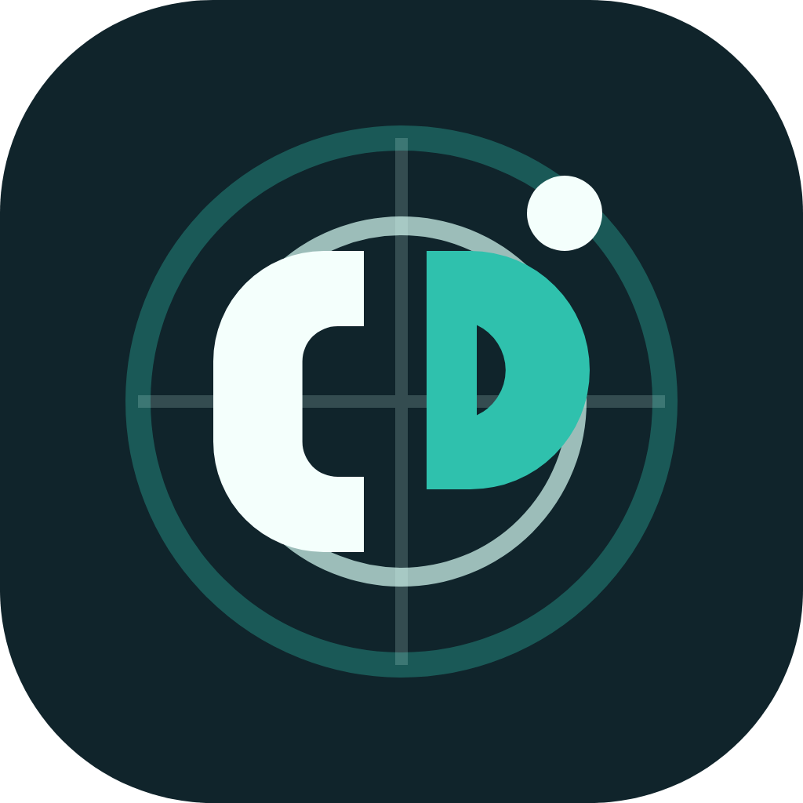
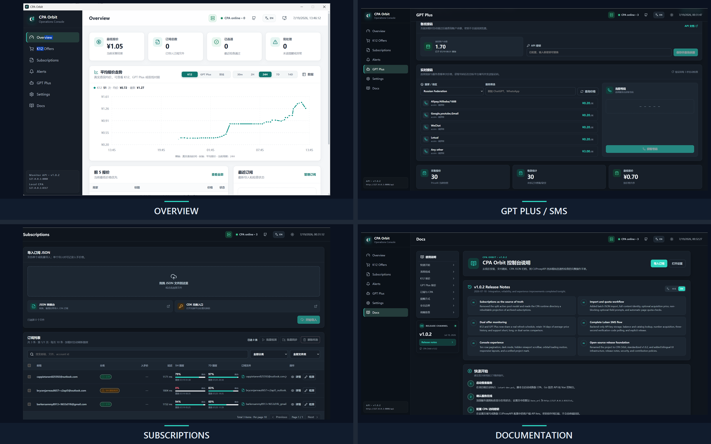
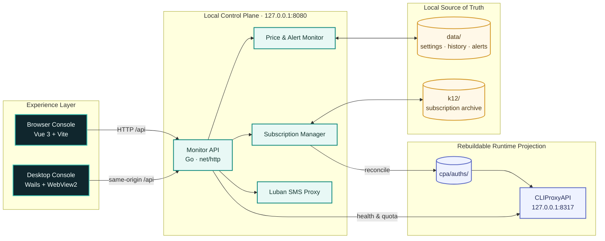

<div align="center">
  
  <h1>CPA Orbit</h1>
  <p><strong>A local-first operations console for AI subscriptions, price intelligence, quota health, and CPA proxy runtime.</strong></p>

  <p>
    <a href="http://165.154.205.54/cpa_orbit/">
      
    </a>
  </p>
  <p><a href="http://165.154.205.54/cpa_orbit/"><strong>English · 简体中文 · Searchable guides, architecture, deployment, and releases</strong></a></p>

  <p>
    <a href="https://github.com/2921323707/CPA_Orbit/actions"></a>
    <a href="https://github.com/2921323707/CPA_Orbit/releases"></a>
    <a href="LICENSE"></a>
    <a href="https://go.dev/"></a>
    <a href="https://vuejs.org/"></a>
    <a href="https://wails.io/"></a>
  </p>

  <p>
    <a href="#overview">Overview</a> ·
    <a href="#showcase">Showcase</a> ·
    <a href="#architecture">Architecture</a> ·
    <a href="#quick-start">Quick start</a> ·
    <a href="http://165.154.205.54/cpa_orbit/">Online Documentation</a> ·
    <a href="docs/CONTRIBUTING.md">Contributing</a>
  </p>
</div>

## Overview

CPA Orbit brings the operational paths that normally live across scripts, browser tabs, and local folders into one coherent workspace. The desktop application and browser console share the same Go runtime, settings, credentials, subscription archive, alerts, and price history. Everything stays local by default and the network services bind to loopback interfaces.

- **Subscription operations** — single or batch JSON import, canonical-content deduplication, archive management, CPA synchronization, quota checks, and connectivity diagnostics.
- **Price intelligence** — K12 and GPT Plus offer collection, current inventory, threshold alerts, and truthful 14-day average-price history.
- **CPA runtime control** — automatic CLIProxyAPI discovery and startup, live health state, auth-pool projection, and shared endpoint visibility.
- **Desktop integration** — compact Wails host, system tray, close-to-tray behavior, native notifications, taskbar alerts, and startup-at-login.
- **SMS workflow** — backend-protected Luban key, country/service discovery, balance, number acquisition, three-second verification polling, and release.
- **Focused interface** — responsive web layout, fixed 1280×800 desktop composition, Auto/Light/Dark themes, accessible states, and restrained loading motion.

## Showcase

<p align="center">
  <a href="docs/assets/showcase/showcase-grid.png">
    
  </a>
</p>

> Showcase data is synthetic. Credential-bearing JSON, tokens, account lists, and private runtime screenshots are never committed.

## Architecture



The archive under `k12/` is the subscription source of truth. `cpa/auths/` is a rebuildable runtime projection, so the web and desktop clients never maintain competing account stores. See the [architecture dossier](docs/architecture/README.md) for trust boundaries, import sequence, failure modes, and ADRs.

## Recent updates

- Unified desktop and browser data, settings, secrets, subscription state, and backend health reporting.
- Added one-click desktop startup for the Monitor API and CLIProxyAPI, plus tray, notifications, taskbar flashing, and startup-at-login controls.
- Added Auto/Light/Dark appearance modes and a stable fixed-size desktop window without resize polling.
- Decoupled Monitor and CLIProxyAPI health checks to prevent false offline status.
- Rebuilt Settings navigation as stable in-page controls and removed route/hash interference.
- Fixed optional-price imports across the Vue numeric model and WebView2 upload boundary; imports now start immediately with bounded requests and guaranteed action recovery.
- Added subscription asset insights for account health, recorded cost, average acquisition price, and seven-day expiry risk.
- Improved route loading, skeleton states, endpoint visibility, shared status feedback, and responsive layouts.
- Added Playwright regression coverage, GitHub CI, structured issue/PR templates, an English-only README, and a categorized documentation system.

See the complete [changelog](docs/releases/CHANGELOG.md).

## Quick start

### Prerequisites

- Go 1.25 or newer
- Node.js 20 or newer with npm
- Windows 10/11 with WebView2 for the desktop executable
- A local CLIProxyAPI runtime only when CPA proxy features are required

### Development workspace

```powershell
git clone https://github.com/2921323707/CPA_Orbit.git
cd CPA_Orbit
.\start-dev.ps1
```

| Service | Local endpoint |
|---|---|
| Web console | `http://127.0.0.1:5173/` |
| Monitor API | `http://127.0.0.1:8080/api` |
| CLIProxyAPI | `http://127.0.0.1:8317/v1` |
| In-app guide | `http://127.0.0.1:5173/docs` |

### Windows desktop build

```powershell
.\app\build-windows.ps1
```

The portable executable is written to `app/build/bin/CPAOrbit.exe`. A repository build automatically shares the root `data/` and `k12/` directories with the browser console and starts or reuses all required local services.

## Verification

```powershell
# Backend and desktop host
.\.tools\go\bin\go.exe test ./...

# Frontend production build and browser regression suite
cd web
npm ci
npm run build
npx playwright install chromium
npm run test:e2e
```

## Documentation

Browse the complete, searchable documentation at **[165.154.205.54/cpa_orbit](http://165.154.205.54/cpa_orbit/)**. The repository links below remain available for offline reading and source review.

| Area | Guide |
|---|---|
| Online documentation | **[Open documentation site](http://165.154.205.54/cpa_orbit/)** |
| Architecture and ADRs | [docs/architecture](docs/architecture/README.md) |
| Desktop development and distribution | [docs/development/desktop.md](docs/development/desktop.md) |
| Backend API and security boundaries | [docs/development/backend.md](docs/development/backend.md) |
| Releases and changelog | [docs/releases](docs/releases/CHANGELOG.md) |
| Contribution and community policies | [docs/community](docs/community/README.md) |
| Complete documentation index | [docs/README.md](docs/README.md) |

## Security

CPA Orbit is local-first, not credential-free. Never commit or share CPA JSON, OAuth tokens, API keys, `data/`, `k12/`, `cpa/auths/`, logs, or screenshots containing account information. Review the [security policy](docs/SECURITY.md) before exposing an endpoint or redistributing a build.

## Data sources and acknowledgements

Offer and price data comes from [PriceAI](https://priceai.cc/). Checkout redirects and order lookup use [LXDP](https://pay.ldxp.cn/). CPA Orbit aggregates, records, and redirects only; source platforms remain authoritative for live prices, inventory, payment, and after-sales terms.

## License

Original CPA Orbit source code is available under the [MIT License](LICENSE). Bundled or referenced third-party components retain their own licenses; see the [third-party notices](docs/THIRD_PARTY_NOTICES.md).
