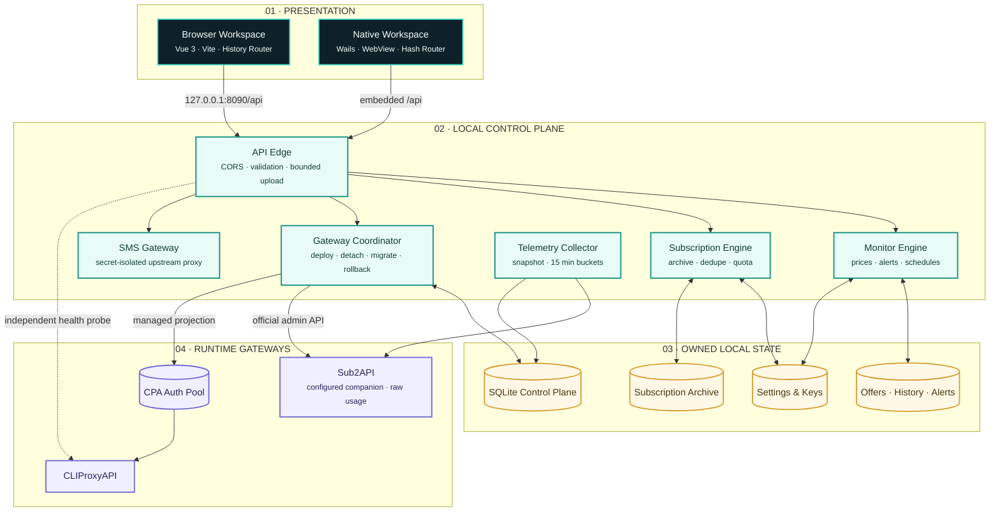
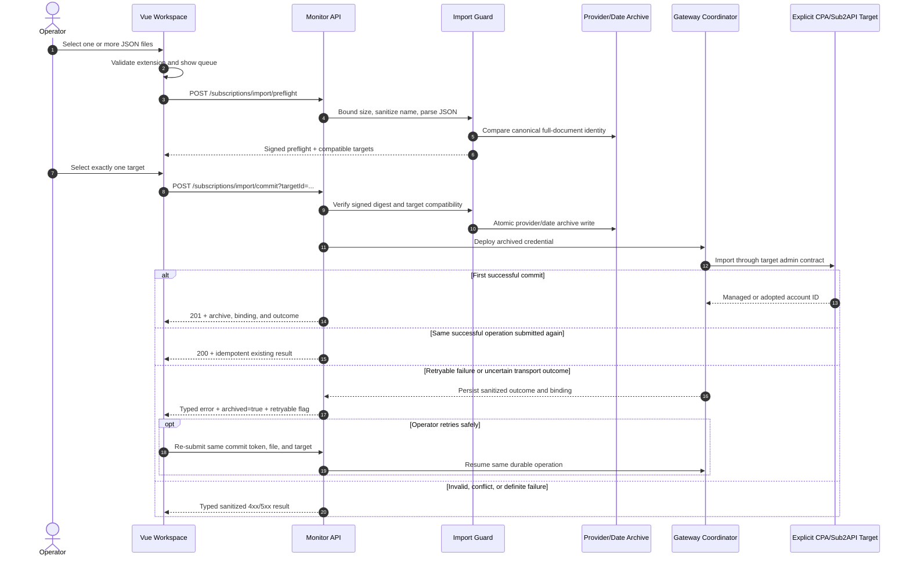
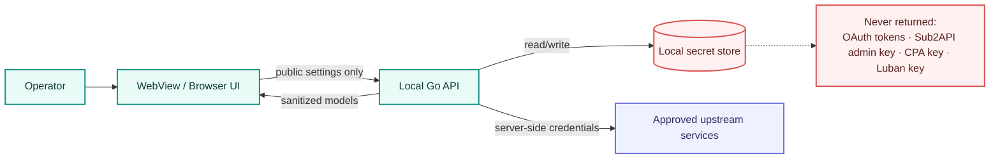

# CPA Orbit architecture dossier

## 1. System intent

CPA Orbit is a local-first modular monolith. It deliberately uses one Go control plane for the browser and desktop clients so operational state cannot drift between two backends. The desktop host embeds the production Vue bundle, exposes the same API handler through Wails, and also publishes the Monitor API on loopback for the browser console. Archived subscription JSON remains the durable asset source; local SQLite records gateway targets, ownership, deployments, operations, and bounded usage aggregates. Sub2API owns its refreshed runtime account state and raw request history, while the CLIProxyAPI auth directory remains a rebuildable CPA projection.

### Non-functional requirements

| Quality | Target |
|---|---|
| Privacy | Secrets remain on the local machine and never enter public API responses |
| Availability | Desktop startup reuses a healthy local API and independently reports CPA degradation |
| Reliability | Archive writes are bounded, sanitized, deduplicated, and never overwrite existing files |
| Performance | UI navigation stays responsive while network checks and refresh jobs run asynchronously |
| Maintainability | One shared application runtime, explicit storage ownership, and recorded architecture decisions |
| Portability | Browser development plus lightweight Windows/macOS Wails packaging |
| Interoperability | Sub2API and CPA remain independent adapters instead of impersonating each other's management protocol |

## 2. Layered topology

## 3. Subscription import sequence

The optional acquisition price never gates the import. It is metadata and part of the durable operation's idempotency contract, not a confirmation boundary. The confirmation boundary is the second-stage explicit selection of exactly one compatible target after safe local Auth JSON preflight. A retryable commit resumes the same operation and target without creating another archive or switching gateways.

## 4. Trust boundaries and secret flow

## 5. Failure modes

| Failure | User-visible behavior | Recovery |
|---|---|---|
| Monitor API cannot bind port 8090 | Startup validates the existing listener; a non-CPA service is rejected | Free the port or start the configured CPA Orbit backend |
| Selected CPA/Sub2API target is unavailable during import | Archive remains safe; a sanitized failed or uncertain outcome identifies the original operation and target | Retry only when marked safe to resume the same operation; otherwise reconcile/detach before explicitly choosing another target |
| CLIProxyAPI is unavailable | Embedded backend remains online; CPA status is shown independently as offline | Start the companion runtime or correct its configured path |
| Upstream price/SMS service fails | Last valid snapshot remains available with a sanitized error state | Retry without inventing price or verification data |
| Import is invalid or duplicated | No archive overwrite; typed error appears in the UI | Correct the document or select a distinct credential file |
| CPA projection is removed | Subscription archive remains authoritative | Reconcile the projection from archived subscriptions |
| Account status/quota polling fails | Last valid status remains visible and is marked stale or uncertain | Retry manually or wait for the independent five-minute poller; interval `0` disables it |

## 6. Decisions and evolution

Significant persistence, trust-boundary, source-of-truth, or external API changes require an ADR under [`architecture/adr/`](adr/). The current system intentionally remains a modular monolith: splitting local services would increase deployment and synchronization risk without improving the single-operator workload.
